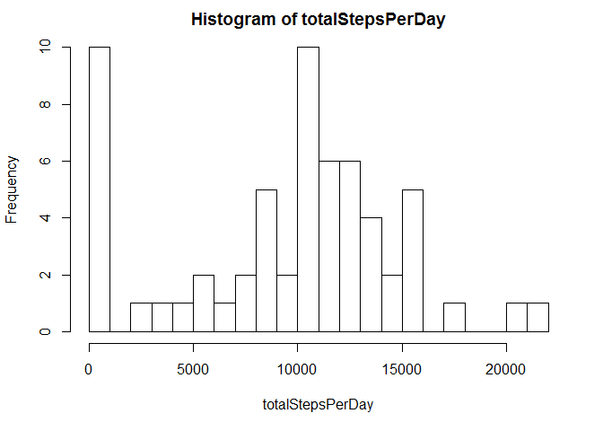
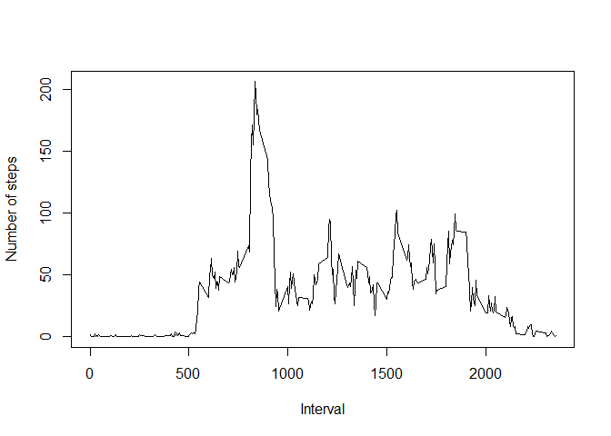
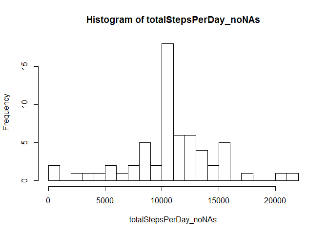
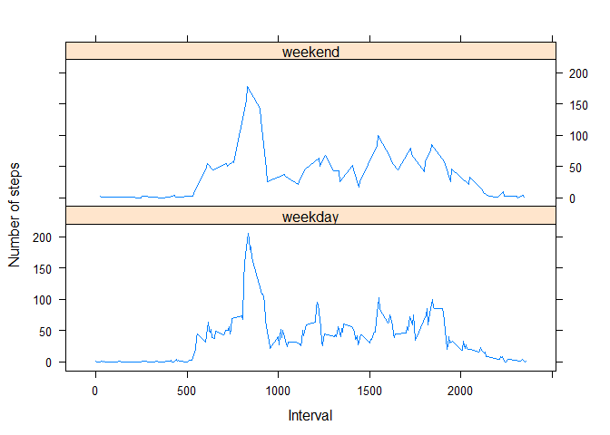

# Reproducible Research: Peer Assessment 1

Marty Straume  
Course 5  
Johns Hopkins University Data Science Specialization  
Coursera

#### Loading and preprocessing the data

##### 1. Read data into data frame


```r
zipFile <- "./activity.zip"
data <- read.csv(unz(zipFile, "activity.csv"))
```

##### 2. Process data\$date and data\$interval to a new data\$datetime column, in POSIXct format

Note that data\$interval is an "unusual" integer implementation of military time

The addition of "0.5" prior to converting to integer "minutes" is to overcome issues due to roundoff and truncation errors associated with floating point calculations (because "as.integer" employs truncation, not rounding up/down)


```r
time <- data$interval
hours <- as.integer(time/100)
minutes <- as.integer((((time/100) - hours) * 100) + 0.5)
time <- paste(hours, minutes, sep = ":")
datetime <- paste(as.character(data$date), as.character(time), sep = " ")
datetime <- as.POSIXct(datetime)
data[,dim(data)[2]+1] <- datetime
colnames(data)[dim(data)[2]] <- "datetime"
remove(datetime, hours, minutes, time)
```

#### What is mean total number of steps taken per day?

For this part of the assignment, you can ignore the missing values in the dataset

##### 1. Calculate the total number of steps taken per day


```r
totalStepsPerDay <- tapply(data$steps, data$date, sum, na.rm = TRUE)
```

##### 2. Make a histogram of the total number of steps taken each day


```r
par(mfrow = c(1,1), mar = c(5.1, 4.1, 2.1, 2.1))
hist(totalStepsPerDay, 22, xlim = c(0, 22000))
```

 

##### 3. Calculate and report the mean and median of the total number of steps taken per day


```r
meanStepsPerDay <- mean(totalStepsPerDay, na.rm = TRUE)
meanStepsPerDay
```

```
## [1] 9354.23
```

The mean total number of steps taken per day is 9354.2295082


```r
medianStepsPerDay <- median(totalStepsPerDay, na.rm = TRUE)
medianStepsPerDay
```

```
## [1] 10395
```

The median total number of steps taken per day is 10395

#### What is the average daily activity pattern?

##### 1. Make a time series plot (i.e. type = "l") of the 5-minute interval (x-axis) and the average number of steps taken, averaged across all days (y-axis)


```r
meanStepsPerInterval <- tapply(data$steps, data$interval, mean, na.rm = TRUE)
x <- as.integer(names(meanStepsPerInterval))
plot(x, meanStepsPerInterval,
     type = "l",
     xlab = "Interval",
     ylab = "Number of steps")
```

 

##### 2. Which 5-minute interval, on average across all the days in the dataset, contains the maximum number of steps?


```r
maxIntervalIndex <- which.max(meanStepsPerInterval)
meanStepsPerInterval[maxIntervalIndex]
```

```
##      835 
## 206.1698
```

#### Imputing missing values

Note that there are a number of days/intervals where there are missing values (coded as NA)

The presence of missing days may introduce bias into some calculations or summaries of the data

##### 1. Calculate and report the total number of missing values in the dataset (i.e. the total number of rows with NAs)


```r
totalRowsWithNAs <- sum(is.na(data))
totalRowsWithNAs
```

```
## [1] 2304
```

##### 2. Devise a strategy for filling in all of the missing values in the dataset

The strategy does not need to be sophisticated

For example, you could use the mean/median for that day, or the mean for that 5-minute interval, etc.

    NOTE: I chose to apply the mean for each 5-minute interval

##### 3. Create a new dataset that is equal to the original dataset but with the missing data filled in


```r
data_noNAs <- data
j <- 0L
for(i in 1:dim(data)[1]){
    j <- j + 1L
    if(j > 288L){j <- 1L}
    if(is.na(data[i,1])){
        data_noNAs[i,1] <- as.numeric(meanStepsPerInterval[j])
    }
}
remove(i, j)
```

##### 4. Make a histogram of the total number of steps taken each day and calculate and report the mean and median total number of steps taken per day


```r
totalStepsPerDay_noNAs <- tapply(data_noNAs$steps, data_noNAs$date, sum)
hist(totalStepsPerDay_noNAs, 22, xlim = c(0, 22000))
```

 

```r
meanStepsPerDay_noNAs <- mean(totalStepsPerDay_noNAs)
meanStepsPerDay_noNAs
```

```
## [1] 10766.19
```

```r
medianStepsPerDay_noNAs <- median(totalStepsPerDay_noNAs)
medianStepsPerDay_noNAs
```

```
## [1] 10766.19
```

##### Do these values differ from the estimates from the first part of the assignment?

The mean steps per day went from 9354.2295082 when NAs were ignored, versus 1.0766189\times 10^{4} when NAs were replaced by the average-per-interval from the former analysis

The median steps per day went from 10395 when NAs were ignored, versus 1.0766189\times 10^{4} when NAs were replaced by the average-per-interval from the former analysis

##### What is the impact of imputing missing data on the estimates of the total daily number of steps?

The impact of imputing missing data, in the present circumstance, caused increases in both the mean daily number of steps (went from 9354.2295082 to 1.0766189\times 10^{4}) and the median daily number of steps (went from 10395 to 1.0766189\times 10^{4})

#### Are there differences in activity patterns between weekdays and weekends?

For this part the weekdays() function may be of some help here

Use the dataset with the filled-in missing values for this part

##### 1. Create a new factor variable in the dataset with two levels - "weekday" and "weekend" - indicating whether a given date is a weekday or weekend day


```r
for(i in 1:dim(data_noNAs)[1]){
    if(weekdays(data_noNAs$datetime[i]) == "Saturday" | 
       weekdays(data_noNAs$datetime[i]) == "Sunday"){
            data_noNAs[i,5] <- "weekend"
    }
    else{
        data_noNAs[i,5] <- "weekday"
    }
}
colNames <- names(data_noNAs)
colNames[5] <- "workday"
names(data_noNAs) <- colNames
data_noNAs$workday <- as.factor(data_noNAs$workday)
remove(colNames)
```

##### 2. Make a panel plot containing a time series plot (i.e. type = "l") of the 5-minute interval (x-axis) and the average number of steps taken, averaged across all weekday days or weekend days (y-axis)

See the README file in the GitHub repository to see an example of what this plot should look like using simulated data


```r
library(lattice)
meanStepsPerInterval_noNAs <- tapply(data_noNAs$steps, data_noNAs$interval, mean)
x <- as.integer(names(meanStepsPerInterval_noNAs))
f <- vector()
j <- 1L
for (i in 1:dim(data_noNAs)[1]){
    if(data_noNAs$interval[i] == "2355") {
        f[j] <- as.character(data_noNAs$workday[i])
        j <- j + 1L
    }
}
f <- as.factor(f)
xyplot(meanStepsPerInterval_noNAs ~ x | f,
       layout = c(1,2),
       type = "l",
       lty = 1,
       xlab = "Interval",
       ylab = "Number of steps")
```

 
